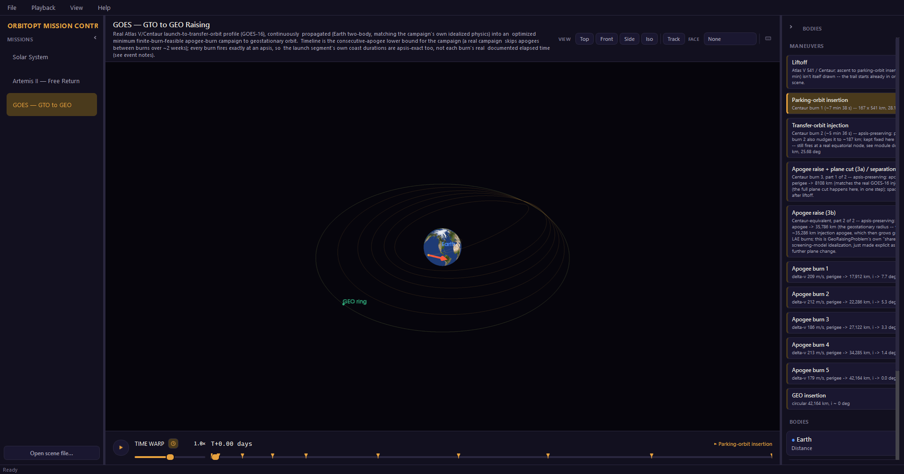
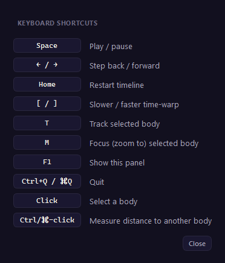
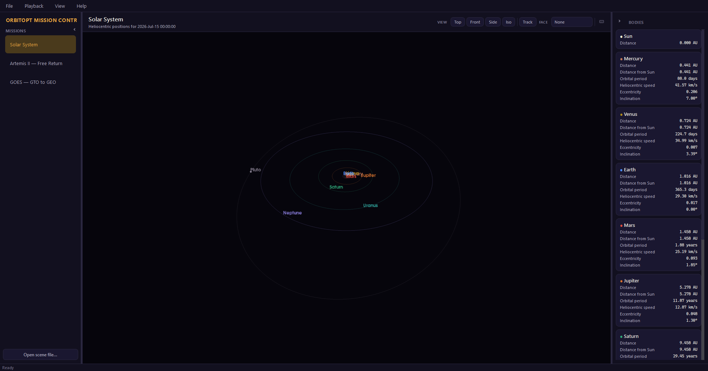

# orbitopt

[](https://github.com/zangjiucheng/orbitopt/actions/workflows/ci.yml)
[](https://github.com/zangjiucheng/orbitopt/actions/workflows/pages.yml)
[](pyproject.toml)
[](LICENSE)
[](https://zangjiucheng.github.io/orbitopt/)

Orbital trajectory optimization research framework built on **pykep**
(fast patched-conic trajectory design + pygmo global optimization) and
**tudatpy** (high-fidelity numerical propagation), with **CUDA-accelerated
batch candidate evaluation** via CuPy.



A plain `pip install orbitopt` (or the `viewer` extra) only gets the
scene-format read/write/validate surface and the PyVista/PySide6 3D viewer --
pykep, tudatpy, pygmo, and CuPy are conda-only (see environment.yml) and are
required for the trajectory optimization/propagation pieces described below.

## Why this split

- **pykep + pygmo**: cheap, analytic/patched-conic trajectory models
  (Lambert arcs, multi-gravity-assist sequences) searched with population-based
  global optimizers. Fast to evaluate, good for exploring huge search spaces,
  but ignores perturbations.
- **tudatpy**: numerical, N-body-capable propagation. Expensive per call, used
  to *verify* a pykep/pygmo solution actually holds up when Earth/Mars/Jupiter
  gravity, etc. are included, not to search the space itself.
- **CUDA (CuPy)**: population-based optimization and porkchop-plot generation
  evaluate thousands to millions of *independent* candidate trajectories per
  run. That evaluation is batched into single vectorized array ops instead of
  a Python loop, running on GPU when available and falling back to vectorized
  numpy otherwise -- same code path either way (`orbitopt.core.gpu`).

## Architecture

```
src/orbitopt/
  __main__.py        `python -m orbitopt` entry point, delegates to cli.py
  scene_format.py    the scene file format's entire read/write/validate surface --
                      zero heavy deps (stdlib + jsonschema only); see "Packaging" below
  mission_config.py  YAML mission-config read/validate/build surface -- same zero-heavy-
                      deps split as scene_format.py; see "Config-driven mission runs" below
  schemas/
    scene-1.0.json              the versioned JSON Schema that IS the scene file format
    mission-geo-raising-1.0.json  config schema for mission.kind: geo-raising
  missions.py        named-mission registry (id -> loader) shared by the app + CLI,
                      with third-party plugin discovery via entry points
  cli.py             the `orbitopt` console command (app / view / export / missions /
                      validate / run)
  core/
    gpu.py          numpy/cupy array-module abstraction (the GPU on/off switch)
    problem.py       OrbitOptProblem base class: pygmo UDP + optional batch_fitness()
  lambert/
    gpu_batch.py      batched 0-rev Lambert solver (universal-variable / Vallado),
                       vectorized -- the framework's core CUDA-acceleration point
    cpu.py             thin wrapper around pykep's reference Izzo solver (multi-rev capable)
  bodies.py            pykep.planet ephemeris + epoch helpers + real Moon state (via tudatpy/SPICE)
  dynamics/
    nbody_gpu.py       GPU-batched, simplified Earth-Moon(-Sun) coarse propagator
                        (two-body Kepler batch solve + osculating Moon/Sun ephemeris +
                        fixed-step RK4) for screening cislunar TLI candidates
  problems/
    transfer_2body.py  single Lambert-leg transfer UDP, with a real batch_fitness()
    mga.py             wraps pykep.trajopt.mga_1dsm; GPU-screens launch windows first
    free_return.py     GPU-batched TLI-burn screening UDP (orbitopt.dynamics.nbody_gpu-backed)
    geo_raising.py     GPU-batched GEO orbit-raising burn-sequence UDP
  optimize/
    gpu_bfe.py         custom pygmo UDBFE that dispatches to a problem's batch_fitness()
    runner.py          drives pygmo algorithms (pso_gen/cmaes/nsga2) through the GPU bfe
  verify/
    tudat_propagate.py numerically propagate a candidate leg and diff vs. the
                        pykep patched-conic prediction; also multi-arc propagation
                        (coast/impulsive-burn sequences) + post-hoc closest-approach
                        and altitude-crossing event detection
    differential_correction.py  fixed-time Newton-Raphson shooting targeter that
                        refines a coarse TLI guess into a precise lunar-flyby distance
    geo_insertion.py   verifies a GEO-raising candidate in tudatpy (numerical
                        propagation of the burn sequence vs. the GPU-screened prediction)
  viz/
    porkchop.py        GPU-batched porkchop grid + plotting
    scene.py           orbitopt's own exporter-side builder helpers (body_entry,
                        scene_document) over the public scene_format/schema above --
                        every exporter below builds through this, not the format directly
    solar_system.py    exports the whole solar system as a SceneData document
    mission_timeline.py exports the Artemis II free-return mission as a
                        scrubbable SceneData document
    geo_raising.py     exports the GEO orbit-raising mission as a SceneData document
    scene_renderer.py  populates a PyVista plotter from a SceneData document --
                        shared by both viewers below, so there's one place
                        that knows how to draw {bodies, orbits, trails}
    pv_viewer.py        minimal single-scene viewer/scripting API (PyVista/VTK)
    theme.py            Qt stylesheet for the app below (dark "tracking station" look)
    icon.py             generates the app's window/taskbar icon programmatically
    icons.py            same approach as icon.py, for small toolbar glyphs (play/pause,
                        panel chevrons, ...) -- real drawn icons, not Unicode/emoji text
    app.py               Mission Control: the persistent, general-purpose desktop
                        app (PySide6 + pyvistaqt) -- mission list, time-warp
                        strip, per-body info cards; see "Mission Control" below
```

The cislunar pieces (`dynamics/nbody_gpu.py`, `problems/free_return.py`,
`verify/differential_correction.py`, plus the Moon ephemeris in `bodies.py`
and the multi-arc extension in `verify/tudat_propagate.py`) implement the
same two-stage pattern as the rest of the framework, applied to an
Artemis-II-like Earth-Moon free-return trajectory: `examples/05_artemis2_free_return.py`
Lambert-seeds a parking-orbit-aligned TLI guess, GPU-batch-screens the burn
vector against a simplified osculating Moon model, then refines the winner
in tudatpy to hit the real Artemis II perilune altitude (6,545 km) to
within ~10 km.

Extending the framework with a new problem type means writing a new
`orbitopt.core.problem.OrbitOptProblem` subclass; if its per-candidate work is
vectorizable, give it a real `batch_fitness()` and it gets GPU accel through
`optimize.runner.run_optimization` for free. If not (e.g. wrapping pykep's own
compiled UDPs, as `problems/mga.py` does), it still works, just CPU-bound --
GPU pre-screening of the search space (see `problems.mga.screen_departure_windows`)
is the fallback acceleration point for that case.

## Packaging: scene files, the viewer, and the compute stack

pykep/pygmo/tudatpy ship only on conda-forge/tudat-team -- they don't exist on
PyPI at all, so "just `pip install orbitopt` and compute a trajectory" is not
achievable in a plain pip environment; that half genuinely needs a conda
environment (see Setup below). But *reading, validating, and viewing* a scene
someone already computed doesn't need any of that, and the package is split
into three layers so that's true in practice, not just in principle:

1. **Scene file format** (`orbitopt.scene_format`, `orbitopt/schemas/scene-1.0.json`)
   -- the base package. Depends on nothing but the standard library +
   `jsonschema`. `pip install orbitopt` gets you `read_scene`/`write_scene`/
   `validate_scene` against a versioned, independent JSON Schema: a scene file
   produced by any orbitopt release validates against the schema version it
   declares (`schemaVersion`), regardless of what orbitopt's own code looks
   like by the time you read it. Adding an optional field to the format is not
   a breaking change (unknown fields are always allowed, GeoJSON-style);
   removing/renaming/narrowing one is, and gets a new `scene-2.0.json` etc.
   with its own `schemaVersion` so old and new documents both keep validating
   against whichever schema they were written for.
2. **Viewer** (`orbitopt[viewer]`: `orbitopt.viz.pv_viewer`, `.scene_renderer`,
   `.app`) -- `pip install orbitopt[viewer]` adds numpy/pyvista/pyside6/
   pyvistaqt, all real PyPI wheels, no conda needed. This is enough to load
   any scene file (yours, a colleague's, one shipped by a different orbitopt
   version) and open it in the single-scene viewer or Mission Control.
3. **Compute** (`orbitopt.problems`, `orbitopt.verify`, `orbitopt.dynamics`,
   and the mission-*computing* viz exporters -- `solar_system.py`,
   `mission_timeline.py`, `geo_raising.py`, `porkchop.py`) -- needs pykep/
   pygmo/tudatpy from conda-forge. There is deliberately no `orbitopt[compute]`
   extras group in `pyproject.toml`: declaring conda-only packages as a pip
   extras would make `pip install orbitopt[compute]` fail outright instead of
   degrading gracefully. Build this layer via `environment.yml` (see Setup).

### Named missions + third-party plugins

`orbitopt.missions` is a small registry -- `(id, title, loader)` -- shared by
Mission Control and the CLI. Built-ins (`solar-system`, `artemis2`, `goes`)
register lazily; a separate pip-installed package can add its own mission
with no orbitopt source changes via a setuptools entry point:

```toml
# your_package's pyproject.toml
[project.entry-points."orbitopt.missions"]
my-mission = "your_package.missions:my_mission"
```
```python
# your_package/missions.py -- my_mission() returns Mission("my-mission", "My Mission", _load)
# _load() returns a SceneData dict (build one, or scene_format.read_scene a bundled file)
```

Discovered at runtime via `importlib.metadata.entry_points`; a broken plugin
is a warning, not a crash for every other mission.

### Config-driven mission runs

The missions above are Python code -- every parameter lives as a source
constant. `orbitopt.mission_config` adds a per-mission-kind YAML path
instead: describe a mission, and `orbitopt` schema-checks it, runs it, and
writes a scene file the viewer already knows how to open.

```yaml
# my_mission.yaml
mission: { id: my-geo-mission, title: My GEO raising campaign, kind: geo-raising }
target: { geostationary_longitude_deg: -101.0 }
campaign_search: { n_burns: { min: 2, max: 6 } }
output: { scene_file: scenes/my-geo-mission.json }
```
```
orbitopt validate my_mission.yaml   # schema-only, no compute -- catches typos fast
orbitopt run my_mission.yaml        # optimize, then tudatpy-verify, then write the scene
```

Every field but `mission`/`output` is optional and falls back to the real
GOES-16 numbers the built-in `goes` mission uses, so a minimal config just
re-derives that mission. `orbitopt run` also re-flies the winner through
`verify.geo_insertion.verify_geo_raising` (tudatpy) and reports whether it
converges to true GEO (`--skip-verify` to skip). See
`schemas/mission-geo-raising-1.0.json` for the full schema and
`geo_raising.py`'s `build_from_config` for the adapter -- one mission kind so
far; porting `free_return`/`mga` the same way is the natural next step.

## Setup

tudatpy is conda-forge/tudat-team only (no PyPI wheels) and pins `python=3.10`;
pykep additionally needs `scipy<1.14` (it still calls the since-removed
`scipy.interpolate.interp2d`). See `environment.yml` / `scripts/setup_env.ps1`.

```powershell
.\scripts\setup_env.ps1
conda activate orbitopt
pytest tests/ -v
```

The GPU package (`cupy-cuda13x`) is pip-installed inside the conda env; adjust
the `cupy-cudaXXx` package name in `environment.yml` to match your CUDA driver
version (`nvidia-smi`) if not CUDA 13.

## Measured results (RTX A3000 Laptop, 6 GB, this machine)

| Workload | CPU (vectorized numpy) | GPU (CuPy) | Speedup |
|---|---|---|---|
| 2,000,000 independent Lambert solves | 82.8 s (24.2k/s) | 17.7 s (112.8k/s) | 4.7x |
| 90,000-cell Earth-Mars porkchop grid | -- | 1.08 s (83.2k solves/s) | -- |

Speedup grows with batch size (GPU kernel-launch overhead dominates at small
N; at 200k it was ~2.5x, at 2M it's 4.7x) -- porkchop grids and wide
population-based optimizer runs are exactly the "large N, no data
dependencies" shape that benefits.

Gotchas that cost real debugging time along the way (full root-cause
writeups in [`docs/engineering-notes.md`](docs/engineering-notes.md)):

- **pygmo**: `bfe` must be attached to the raw UDA before wrapping it in
  `pg.algorithm(uda)`, or it silently falls back to evaluating one candidate
  at a time -- ~15x slower, no error.
- **SPICE**: `"J2000"` and `"ECLIPJ2000"` frames are ~23.4 degrees apart and
  not interchangeable; mixing them silently produces errors of hundreds of
  thousands of km.
- **RK4 step size**: fine for a multi-day coast, NOT fine near a close lunar
  flyby -- 600s reported an 81,733 km closest approach where 15s converged
  to 4,379 km.
- **GPU isn't always faster**: `nbody_gpu.propagate_spacecraft_batch` is
  GPU-*slower* than CPU below ~20,000 candidates -- measured, not assumed.
- **Undamped Newton diverges on real inputs**: an imprecise upstream guess
  sent a plain Newton targeter into runaway divergence; fixed with a
  sanity-checked initial guess and a damped/backtracking step.

## Examples

- `01_earth_mars_lambert_gpu.py` -- optimize an Earth->Mars transfer with
  pygmo PSO, every generation GPU-batched.
- `02_mga_cassini_like.py` -- GPU-screen Earth->Venus launch windows, then
  optimize a 5-body MGA-1DSM sequence seeded from the screening result.
- `03_verify_with_tudat.py` -- propagate a pykep Lambert solution through
  tudatpy's N-body dynamics and report the drift vs. the two-body prediction.
- `04_porkchop_gpu.py` -- a full Earth->Mars porkchop grid from one batched
  GPU call.
- `05_artemis2_free_return.py` -- the cislunar free-return pipeline below.
- `06_solar_system_explorer_data.py` / `07_mission_timeline_data.py` --
  regenerate cached SceneData JSON (the viewer can also compute these live).
- `10_gto_geo_orbit_raising.py` -- the GOES-style GTO->GEO campaign; see
  `docs/goes_gto_geo_mission_plan.md`.

## Mission Control (general-purpose desktop app)

```
orbitopt            # or: orbitopt-app  /  python -m orbitopt  /  python -m orbitopt app
```

`pip install -e .` puts the `orbitopt` and `orbitopt-app` console scripts on
PATH (see `orbitopt.cli` for the `app` / `view` / `export` / `validate` /
`run` subcommands); the `examples/` scripts are annotated references, not
the way to start the app.
Keyboard shortcuts inside the app: Space play/pause, ←/→ step, Home restart,
`[` / `]` change time-warp, T track the selected body, M focus/zoom to it,
F1 (or the keyboard icon in the view-controls row) opens an in-app shortcuts
reference, ⌘Q/Ctrl+Q quit. Every toolbar glyph (play/pause, panel-collapse
chevrons, the shortcuts icon) is a real vector icon drawn with QPainter
(`orbitopt/viz/icons.py`), the same approach `icon.py` already used for the
app's own window icon -- not a Unicode symbol used as button text.



A persistent app, not a script that renders one scene and exits: a mission
list sidebar (Solar System, Artemis II, plus `File > Open scene file...`
for any `SceneData` JSON) you switch between without relaunching, a 3D view
in the middle, live per-body orbit-info cards on the right (distance,
period, eccentricity, inclination -- whatever `info` rows that scene's
exporter attached), and a time-warp control strip at the bottom for scenes
with a timeline (0.15x through 100x, plus direct scrubbing). Built with
PySide6 + pyvistaqt: the 3D content is the exact same PyVista/VTK renderer
as the single-scene viewer below (`orbitopt/viz/scene_renderer.py`, shared
by both -- see it for the split between "rebuild everything" on mission
switch vs. "just move points and swap the trail actor" on every timeline
tick), the surrounding chrome is real Qt widgets styled after a dark
"tracking station" look (`orbitopt/viz/theme.py`) -- KSP's map view was the
reference point for what that chrome should *do* (a vessel list you switch
between, a time-warp strip, per-body info readouts), not a literal skin to
copy.

Clicking a body card also focuses the camera on it, same idea as KSP's
tracking-station vessel list.

Testing this needed a real (if briefly-shown) window, not a headless one --
`tests/test_app.py`; see [`docs/engineering-notes.md`](docs/engineering-notes.md)
for the screenshot-API gotcha that surfaced.

## Single-scene 3D viewer (PyVista, no app chrome)

```
orbitopt view solar-system
orbitopt view artemis2
orbitopt view goes
orbitopt view path/to/some_scene.json
```



A real desktop window (PyVista/VTK -- no browser, no HTML/CSS/JS anywhere
in this package): drag to orbit the camera, scroll/pinch to zoom, click a
body for its info panel. Scenes with a `timeline` (currently just the
Artemis II mission) get a scrubber slider at the bottom -- dragging it
moves the spacecraft/Moon to their position at that mission time, redraws
the "traveled so far" trail, and updates the live distance readout.

Every scene the viewer can open is the same `SceneData` dict (see
`orbitopt/viz/scene.py`): `{title, distanceUnit, bodies: [{id, name, color,
kind, radiusDisplay, orbit?, position?, trail?, info?}], timeline?}`. The
viewer (`orbitopt/viz/pv_viewer.py`) has exactly one render path for that
shape -- adding a new scene (a Lambert transfer, an MGA sequence, anything
else this framework computes) means writing another small exporter that
builds a `SceneData` document through `viz.scene`'s helpers, not touching
the viewer. `load_scene(path)` reads one from disk; `show_scene(scene)`
opens it -- both are plain functions you can call from a script or a
notebook, e.g.:

```python
from orbitopt.viz.pv_viewer import show_scene
from orbitopt.viz.solar_system import export_solar_system_data
show_scene(export_solar_system_data())
```

Body markers render via VTK's `render_points_as_spheres` point rendering
(constant screen-pixel size regardless of camera distance, sidestepping a
real world-space-scaling bug an earlier browser/Three.js iteration of this
viewer had); the timeline scrubber needs `interaction_event='always'` to
fire while dragging, not just on release. Both covered in
[`docs/engineering-notes.md`](docs/engineering-notes.md).

## Cislunar / Artemis II free-return pipeline

`examples/05_artemis2_free_return.py` chains every layer of the framework:
a Lambert-arc TLI seed (`lambert.cpu`, aimed at the Moon's real SPICE
position) &rarr; GPU coarse screening (`problems.free_return`) &rarr; tudatpy
differential correction (`verify.differential_correction.target_lunar_flyby`)
converging to the real Artemis II perilune altitude (6,545 km) within ~10 km
&rarr; independent fine-resolution re-verification. It's an independent
re-solve of the same boundary-value problem, not a reproduction of the
actual flown mission (NASA hasn't published navigation-grade state vectors
to fit against), and targets flyby *distance* only -- no B-plane aim-point
control yet, so the post-flyby trajectory won't re-enter on its own. Full
step-by-step breakdown and caveats in
[`docs/engineering-notes.md`](docs/engineering-notes.md).

## Known limitations / extension points

- The batched Lambert solver handles 0-revolution transfers only (multi-rev
  falls back to `orbitopt.lambert.cpu.solve_lambert_single`, which wraps
  pykep's full Izzo solver).
- `verify.tudat_propagate` uses point-mass gravity only; extending to
  spherical harmonics / SRP / drag is a matter of adding
  `propagation_setup.acceleration` terms.
- Low-thrust (continuous-thrust) trajectories aren't modelled yet; pykep's
  `sims_flanagan`/shape-based modules would plug in the same way `mga.py`
  wraps `mga_1dsm`.
- `dynamics.nbody_gpu`'s Moon/Sun ephemeris is a pure two-body osculating
  orbit seeded once from a real SPICE state at J2000 -- accurate to a few
  thousand km over a several-day coast (validated), but not re-seeded for
  epochs far from J2000 or spans much longer than ~10 days.
- The free-return targeter is distance-only / fixed-time (see above); no
  B-plane aim-point control, no multi-point (outbound + return) targeting,
  no trajectory-correction-burn modelling.

## License

GPL-3.0-or-later -- see [`LICENSE`](LICENSE) for the full text. Copyright (C)
2026 Jiucheng Zang.
